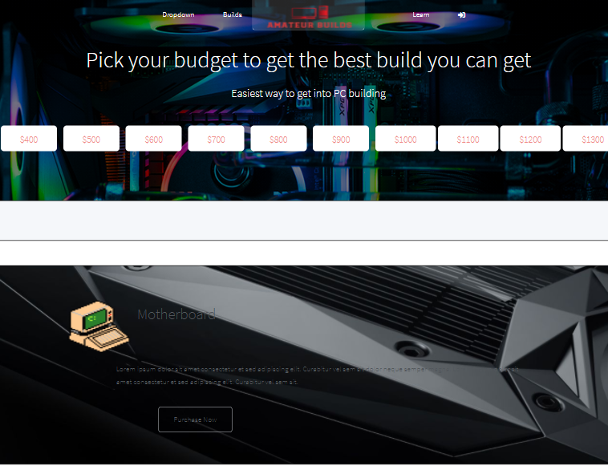

# My Demo day project
My DemoDay project is called Amateur Builds. This Full-Stack application allows new users to receieve a custom PC build based on their budget. It is a user-friendly site allowing users who don't understand anything about computers to get into this awesome hobby by building on your self. The hardest part is choosing parts since you're proabably thinking there are so many parts and you have no idea what each part does. I want to ease that process since now more than ever it is becoming more popular. I want users who log it to save their builds and post their builds to a public forum where you'll be able to see everyone builds.

&emsp;

&emsp;&emsp;&emsp;&emsp;&emsp;&emsp;&emsp;&emsp;&emsp;&emsp;&emsp;&emsp;&emsp;&emsp;&emsp;[Click Here to go to the website!](https://am-builds.herokuapp.com/)
## How Its Made 
**Languages used:** Html, CSS, Javascript, Node.js , MongoDB , Express
# What I Learned
I learned how to save user data in the back end and retrieve that data whenever I want. 
### My Other Projects 
Check out some of my other work using the DOM!
* [JDM Express](https://github.com/BrianMelaraDev/jdmPersonalExpress/blob/main/README.md)
* [Uzi Tracker](https://github.com/BrianMelaraDev/lilUziTracker)
